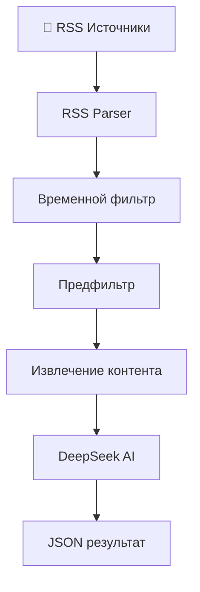

#  Анализатор новостей по драгоценным металлам


Интеллектуальный парсер новостей, который автоматически находит и анализирует новости о драгоценных металлах (золото, серебро, платина, палладий) с использованием AI модели DeepSeek.

## ✨ Возможности

-  **Многоисточниковый парсинг** - обработка RSS лент от ведущих финансовых изданий
-  **AI-анализ с DeepSeek** - точное определение релевантности через OpenRouter API
-  **Двухуровневая фильтрация** - предфильтр по ключевым словам + глубокий AI анализ
-  **Детальная аналитика** - статистика обработки и эффективности
-  **Структурированный вывод** - сохранение в JSON с метаданными
-  **Оптимизированная обработка** - экономия API запросов до 70%

##  Архитектура системы



### 📦 Модульная структура

| Модуль | Назначение |
|--------|------------|
| `parser.py` | Основной парсер RSS лент |
| `filters.py` | Предварительная фильтрация по ключевым словам |
| `extractor.py` | Извлечение полного текста статей |
| `analyzer.py` | AI анализ через DeepSeek на OpenRouter |
| `models.py` | Модели данных и структуры |

## 🚀 Быстрый старт

### Установка

```bash
# Клонируем репозиторий
git clone https://github.com/XQwart/Precious-Metals-News-Analyzer.git
cd Precious-Metals-News-Analyzer

# Устанавливаем зависимости
pip install -r requirements.txt
```

### Настройка API ключа

Получите API ключ на [OpenRouter.ai](https://openrouter.ai/) и добавьте в переменные окружения:

```bash
export OPENROUTER_API_KEY="your_api_key_here"
```

Или создайте файл `.env`:
```
OPENROUTER_API_KEY=your_api_key_here
```

### Запуск

```bash
python main.py
```

## 📖 Использование

### Базовый запуск

```python
from parser import MetalsNewsParser

# Создаем парсер
parser = MetalsNewsParser()

# Парсим новости за последние 24 часа  
news_items = parser.parse_all_sources(max_age_hours=24)

# Сохраняем результаты
filename = parser.save_to_json(news_items)
print(f"Сохранено в {filename}")
```

### Настройка временных рамок

```python
# Новости за последнюю неделю
news_items = parser.parse_all_sources(max_age_hours=168)

# Новости за последний месяц
news_items = parser.parse_all_sources(max_age_hours=720)
```

### Тестирование фильтров

```bash
python test_filters.py
```

## ⚙️ Конфигурация

### Ключевые слова для фильтрации

```python
metal_keywords = {
    'золото': ['золот', 'gold', 'au', ...],
    'серебро': ['серебр', 'silver', 'ag', ...],
    'платина': ['платин', 'platinum', 'pt', ...],
    'палладий': ['палладий', 'palladium', 'pd', ...]
}
```

## 📁 Структура проекта

```
metals-news-parser/
├── parser.py            # Основной парсер
├── filters.py           # Предварительные фильтры
├── extractor.py         # Извлечение контента
├── analyzer.py          # AI анализатор
├── models.py            # Модели данных
├── requirements.txt     # Зависимости
├── metals_news.json     # Результаты (создается автоматически)
└── README.md           # Документация
```

## 📊 Пример вывода

```
🚀 МОДУЛЬНЫЙ DEEPSEEK ПАРСЕР ДРАГОЦЕННЫХ МЕТАЛЛОВ
================================================================
🤖 AI: DeepSeek через OpenRouter.ai
📊 Релевантных новостей: 5
🎯 Средняя релевантность: 0.87

📈 ЭФФЕКТИВНОСТЬ ОБРАБОТКИ:
   Всего проверено: 247
   Предфильтр исключил: 198
   AI проанализировал: 49
   Итого релевантных: 5
   Точность AI: 10.2%
   Экономия API: 80.2%

🥇 ПО МЕТАЛЛАМ:
   Золото: 3
   Серебро: 1
   Платина: 1

🏆 ТОП-3 НОВОСТИ:
1. Цены на золото достигли исторического максимума
   📊 Релевантность: 0.95 | 🏢 РБК Экономика
   
2. Центробанк увеличил покупки золота на 15%
   📊 Релевантность: 0.88 | 🏢 Финам
```

## 🔧 Устранение неполадок

### Частые проблемы

**❌ Ошибка "RSS document declared as us-ascii"**
```
Решение: Это предупреждение, не влияет на работу
```

**❌ Нет новостей из всех источников**
```bash
# Проверьте доступность RSS лент
python -c "import feedparser; print(feedparser.parse('https://rssexport.rbc.ru/rbcnews/news/20/full.rss'))"
```

**❌ AI анализатор не работает**
```bash
# Проверьте API ключ
echo $OPENROUTER_API_KEY
```

### Отладка

Включите подробное логирование:

```python
import logging
logging.basicConfig(level=logging.DEBUG)
```

## 🔑 Получение API ключа OpenRouter

1. Зарегистрируйтесь на [OpenRouter.ai](https://openrouter.ai/)
2. Создайте API ключ в разделе "Keys"
3. Добавьте ключ в переменные окружения

**Стоимость**: ~$0.002 за анализ одной новости

## 📝 Лицензия

Этот проект лицензирован под MIT License - см. файл [LICENSE](LICENSE) для подробностей


